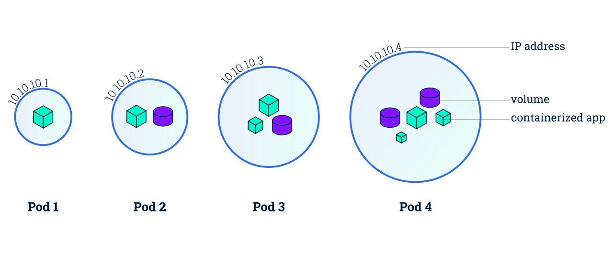
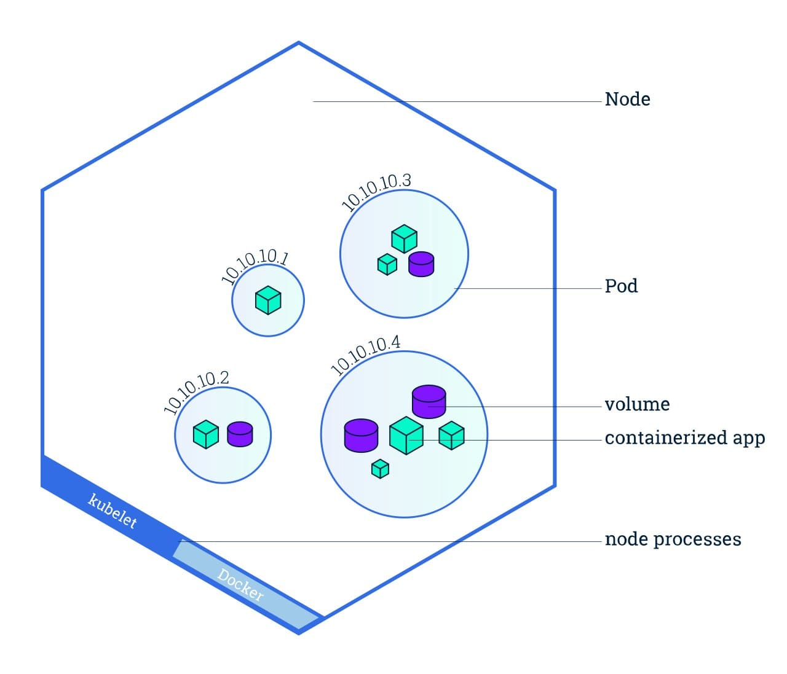
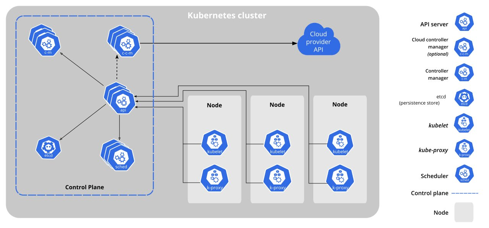
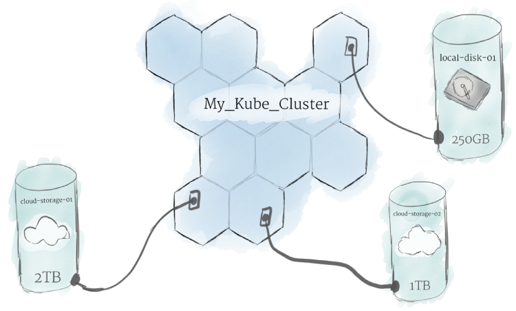
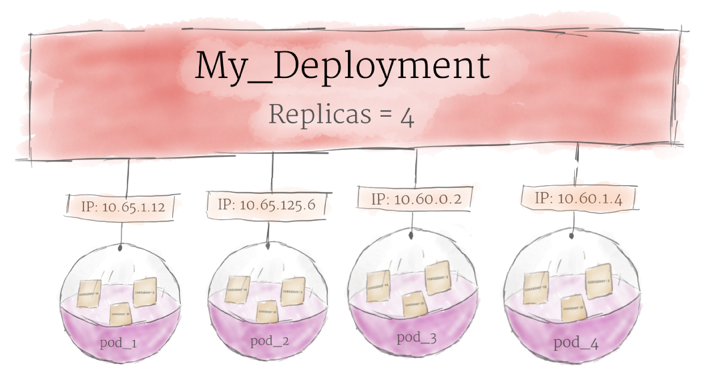
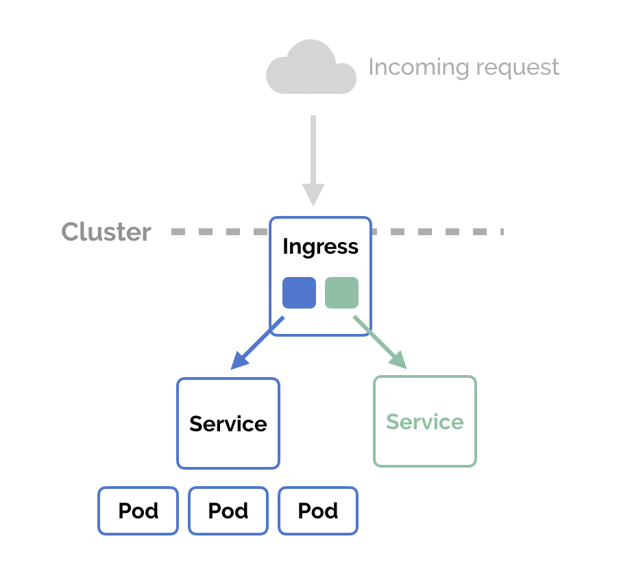
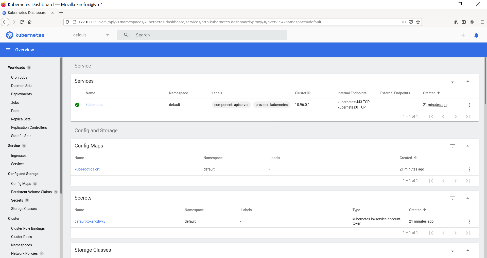
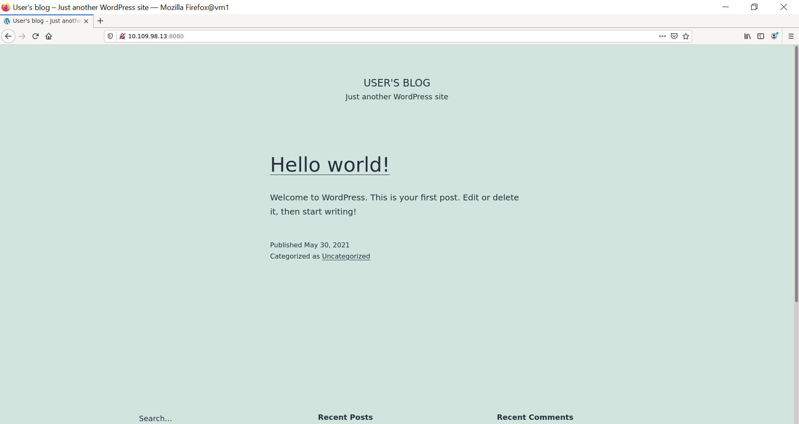

# Week 4

## Mục lục

- [Week 4](#week-4)
  - [Mục lục](#mục-lục)
  - [I. Overview](#i-overview)
    - [1. Kubernetes](#1-kubernetes)
      - [a) Kubernetes là gì?](#a-kubernetes-là-gì)
      - [b) Các thành phần chính của Kubernetes](#b-các-thành-phần-chính-của-kubernetes)
        - [**Container**](#container)
        - [**Pods**](#pods)
        - [**Nodes**](#nodes)
        - [**Cluster**](#cluster)
      - [c) 1 số thành phần khác của Kubernetes](#c-1-số-thành-phần-khác-của-kubernetes)
        - [Persistent Volumes](#persistent-volumes)
        - [Service](#service)
        - [Deployment](#deployment)
        - [Ingress](#ingress)
        - [ConfigMaps and Secrets](#configmaps-and-secrets)
  - [II. Practicing](#ii-practicing)
    - [1. Requirement](#1-requirement)
      - [a) kubectl](#a-kubectl)
      - [b) minikube](#b-minikube)
    - [2. Deploy](#2-deploy)
      - [a) Ý tưởng](#a-ý-tưởng)
      - [b) Maria database](#b-maria-database)
        - [Persistent Volume Claim File](#persistent-volume-claim-file)
        - [Deployment File](#deployment-file)
        - [Service File](#service-file)
        - [Runnung](#runnung)
      - [b) Wordpress](#b-wordpress)
      - [c) Testing](#c-testing)
  - [References](#references)

## I. Overview

### 1. Kubernetes

#### a) Kubernetes là gì?

Kubernetes (còn gọi là k8s - tức là bắt đầu bằng chữ "k", giữa là 8 ký tự và cuối là chữ "s" 😃) là một hệ thống để chạy, quản lý, điều phối các ứng dụng được container hóa trên một cụm máy (1 hay nhiều) gọi là cluster. Với Kubernetes bạn có thể cấu hình để chạy các ứng dụng, dịch vụ sao cho phù hợp nhất khi chúng tương tác với nhau cũng như với bên ngoài. Bạn có thể điều chỉnh tăng giảm tài nguyên, bản chạy phục vụ cho dịch vụ (scale), bạn có thể cập nhật (update), thu hồi update khi có vấn đề ... Kubernetes là một công cụ mạnh mẽ, mềm dẻo, dễ mở rộng khi so sánh nó với công cụ tương tự là Docker Swarm!

#### b) Các thành phần chính của Kubernetes

Ở phần này, ta sẽ tiếp cận cấu trúc của Kubernetes từ trong ra ngoài.

##### **Container**

Conainer là một run-time environment mà ở đó người dùng có thể chạy một ứng dụng độc lập. Những container này rất gọn nhẹ và cho phép bạn chạy ứng dụng trong đó rất nhanh chóng và dễ dàng. Mặc dù về lý thuyết, 1 container có thể có nhiều application nhưng để đảm bảo tính isolate (cô lập) thì 1 container nên chỉ có 1 application. Điều này giúp cho việc triển khai container và tìm ra lỗi sẽ dễ dàng hơn (chỉ cần sửa application trong container bị lỗi mà không cần động chạm tới application khác).

##### **Pods**

"Pods are the smallest deployable units of computing that you can create and manage in Kubernetes." [[5]](#5)



Khi một ứng dụng được đóng gói thì ứng dụng đó sẽ có thể chạy trên một container độc lập, tuy chúng ta có thể chạy container độc lập như cách khởi chạy một ứng dụng monolythic, nhưng Kubernetes sẽ không chạy theo cách như vậy, Kubernetes sử dụng khái niệm pod để nhóm các container lại với nhau. **Một pod là một nhóm các container**, các container này sẽ dùng chung tài nguyên và network, các container trong một pod có thể duy trì giao tiếp với nhau như trên một máy chủ nhưng vẫn giữ được sự độc lập cần thiết.

Pods còn được sử dụng là 1 đơn vị sao chép (unit of replication) ở trong Kubernetes. Nghĩa là nếu application của bạn bị quá tải và 1 instance của pods không thể `carry the load` thì Kubernetes hoàn toàn có thể được config để nhân bản, triển khai (deploy) thêm các pods nếu cần thiết. Ngay cả bình thường, bạn vẫn có thể tạo ra nhiều instance. (Giống lập trình oop, 1 class có thể tạo ra nhiều instance của nó. Tưởng tượng pods cũng gần giống thế). Vì lý do đó pods ở trong Kubernetes được coi là không ổn định (khi cần thì tạo thêm, khi không cần thì xoá bớt - mỗi lần vậy thì ip của pods sẽ khác và data ở trong pod sẽ bị reset lại như mới).

Tương tự như container, về lý thuyết pods có thể chứa 1 hoặc nhiều container nhưng mà bạn nên hạn chế cho quá nhiều container vào 1 pods. Bởi vì như đã nói ở trên, số lượng instance của pods có thể tăng hoặc giảm khi application bị quá tải, tuy nhiên có thể không phải application nào cũng bị tình trạng như vậy. Nên việc tăng giảm có thể gây ra sự lãng phí tài nguyên.

Bạn có thể tham khảo thêm về Sidecar pattern (khi nào sử dụng multi container in pods) [[6]](#6)

##### **Nodes**

Kubernetes nodes là các máy ảo hay máy vật lý chạy kubernetes. Các node này cần chạy Kubernetes và docker, và mỗi máy này là một docker host.

Về mặt phần cứng, nodes là đơn vị nhỏ nhất trong Kubernetes. Trong hầu hết các hệ thống Kubernetes, một node có thể sẽ là một máy vật lý thật sự hoặc máy ảo của một cloud platform như Google Cloud Platform hay AWS, hoặc đơn giản là một máy ảo được tạo bởi VirtualBox trên một máy đơn.

Một cách đơn giản, chúng ta có thể xem mỗi node như một tập hợp tài nguyên CPU và RAM có thể được sử dụng. Vì vậy, từ 1 máy tính vật lý hay ảo đến 1 chiếc smart watch cũng có thể coi là 1 cluster.


1 hay nhiều Pods sẽ luôn chạy trong 1 node. Mỗi Kubernetes Node tổi thiếu luôn chứa các thành phần sau:

- Kubelet: một tác nhân chịu trách nhiệm giao tiếp giữa Kubernetes Master và Node; nó quản lý các Pod và các vùng chứa đang chạy trên máy.
- Container runtime:
  - Container runtime là phần mềm chịu trách nhiệm chạy các container (pulling the container image from a registry, unpacking the container, and running the application).
  - Kubernetes hỗ trợ một số container runtime như: Docker, containerd, CRI-O và bất kỳ triển khai nào của Kubernetes CRI (CRI - Container Runtime Interface - Giao diện thời gian chạy vùng chứa).
- kube-proxy:
  - kube-proxy là một proxy mạng chạy trên mỗi Node trong cụm của bạn, triển khai một phần của khái niệm Kubernetes Service.
  - kube-proxy duy trì các quy tắc mạng trên các Node. Các quy tắc mạng này cho phép giao tiếp mạng với Pod của bạn từ các phiên mạng bên trong hoặc bên ngoài cụm của bạn.
  - kube-proxy sử dụng lớp lọc gói của hệ điều hành nếu có và nó có sẵn. Nếu không, kube-proxy sẽ tự chuyển tiếp lưu lượng.



##### **Cluster**

Một Kubernetes cluster là một tập các nodes. Các node này cần cài đặt docker và Kubernetes.

Trong Kubernetes, các nodes gộp tài nguyên của chúng lại với nhau để tạo thành một cỗ máy mạnh hơn. Khi bạn triển khai các application trên cluster, nó sẽ tự triển khai trên nodes tốt nhất mà nó chấm điểm.

Bạn có thể tham khảo thêm ở [[7]](#7) về cách phân chia các cluster hợp lý.



Trong mỗi cluster có control plane giúp đưa ra các quyết định chung về Cluster (ví dụ: scheduling), quản lý các node và cũng như phát hiện và phản hồi các `event` của Cluster.

Control Plane có thể được chạy trên bất kỳ node nào trong Cluster. Ở 1 số hệ thống như của `OpenShift Container Platform` thì control plane chạy trên 1 node và node đó được gọi là master node.

Các thành phần của control plane:

- kube-apiserver
  - API Server là một thành phần của Kubernetes control plane, mà nó expose Kubernetes API, API Server là một lớp ngoài (front-end ) của Kubernetes Control Plane.
  - Thành phần triển khai chính của Kubernetes API Server là kube-apiserver, kube-apiserver được thiết kế để scale horizon (nó sẽ scale thông qua việc tăng số lượng server)
  - Bạn có thể chạy 1 vài instance chạy kube-apiserver để cân bằng lưu lượng traffic trên các instance này.
- etcd
  - Là nơi lưu trữ dữ liệu cố định và high-available dạng key-value của Kubernetes Cluster.
  - Nếu Kubernetes cluster sử dụng etcd để lưu trữ dữ liệu cluster thì bạn phải đảm bảo có phương án back up cho những dữ liệu này.
- kube-scheduler
  - Nó sẽ xem xét cho những Pods được sinh ra mới nhất chưa được gán cho 1 node nào, và chọn 1 node để pod sinh ra này chạy trên node đó.
- kube-controller-manager
- cloud-controller-manager

#### c) 1 số thành phần khác của Kubernetes

##### Persistent Volumes

Như ta đã biết pods thường không ổn định. Do đó, để lưu trữ dự liệu Kubernetes sử dụng persisten volumes.



- PersistentVolume (`pv`) là một phần không gian lưu trữ dữ liệu tronnng cluster, các PersistentVolume giống với Volume bình thường tuy nhiên nó tồn tại độc lập với POD (pod bị xóa PV vẫn tồn tại), có nhiều loại PersistentVolume có thể triển khai như NFS, Clusterfs...

- PersistentVolumeClaim (`pvc`) là yêu cầu sử dụng không gian lưu trữ (sử dụng PV). Hình dung PV giống như Node, PVC giống như POD. POD chạy nó sử dụng các tài nguyên của NODE, PVC hoạt động nó sử dụng tài nguyên của PV.


##### Service

Các POD được quản lý trong Kubernetes, trong vòng đời của nó chỉ diễn ra theo hướng - được tạo ra, chạy và khi nó kết thúc thì bị xóa và khởi tạo POD mới thay thế. ! Có nghĩa ta không thể có tạm dừng POD, chạy lại POD đang dừng ...

Mặc dù mỗi POD khi tạo ra nó có một IP để liên lạc, tuy nhiên vấn đề là mỗi khi POD thay thế thì là một IP khác, nên các dịch vụ truy cập không biết IP mới nếu ta cấu hình nó truy cập đến POD nào đó cố định. Để giải quết vấn đề này sẽ cần đến Service.

Service (micro-service) là một đối tượng trừu tượng nó xác định ra một nhóm các POD và chính sách để truy cập đến POD đó. Nhóm cá POD mà Service xác định thường dùng kỹ thuật Selector (chọn các POD thuộc về Service theo label của POD).

Cũng có thể hiểu Service là một dịch vụ mạng, tạo cơ chế cân bằng tải (load balancing) truy cập đến các điểm cuối (end point) (thường là các Pod) mà Service đó phục vụ.


##### Deployment

Deployment quản lý một nhóm các Pod - các Pod được nhân bản, nó tự động thay thế các Pod bị lỗi, không phản hồi bằng pod mới nó tạo ra. Như vậy, deployment đảm bảo ứng dụng của bạn có một (hay nhiều) Pod để phục vụ các yêu cầu.

Deployment sử dụng mẫu Pod (Pod template - chứa định nghĩa / thiết lập về Pod) để tạo các Pod (các nhân bản replica), khi template này thay đổi, các Pod mới sẽ được tạo để thay thế Pod cũ ngay lập tức.

Bạn nên sử dụng deployment để triển khai thay vì triển khai trực tiếp (`kind: Pods`).



##### Ingress

Ingress là thành phần được dùng để điều hướng các yêu cầu traffic giao thức HTTP và HTTPS từ bên ngoài (interneet) vào các dịch vụ bên trong Cluster.



**Ingress chỉ để phục vụ các cổng, yêu cầu HTTP, HTTPS** còn các loại cổng khác, giao thức khác để truy cập được từ bên ngoài thì dùng Service với kiểu `NodePort` và `LoadBalancer`.


##### ConfigMaps and Secrets

Một software ít khi chạy luôn mà không cần config. ConfigMap là giải pháp để nhét 1 file config / đặt các ENVironment var hay set các argument khi gọi câu lệnh. ConfigMap là một cục config, mà pod nào cần, thì chỉ định là nó cần - giúp dễ dàng chia sẻ file cấu hình. Ít ai muốn đặt mật khẩu vào file cấu hình, và chỉ có lập trình viên "tồi" mới hardcode mật khẩu vào code. Vậy nên K8s có "secret", để lưu trữ các mật khẩu, token, ... hay những gì cần giữ bí mật.

## II. Practicing

### 1. Requirement

#### a) kubectl

Là command-line tool, nó được sử dụng để kết nối và tương tác với Cluster Kubernetes. Đây là công cụ chính để làm việc với Kubernetes.

Cài đặt:

1. Tải kubectl mới nhất với câu lệnh (Sẽ file ở thư mục hiện tại):

    ```bash
    curl -LO "https://dl.k8s.io/release/$(curl -L -s https://dl.k8s.io/release/stable.txt)/bin/linux/amd64/kubectl"
    ```

    Kết quả:

    ```bash
    % Total    % Received % Xferd  Average Speed   Time    Time     Time  Current
                                    Dload  Upload   Total   Spent    Left  Speed
    100   154  100   154    0     0    396      0 --:--:-- --:--:-- --:--:--   396
    100 45.3M  100 45.3M    0     0  6508k      0  0:00:07  0:00:07 --:--:-- 8665k
    ```

2. Cài đặt kubectl:

    ```bash
    sudo install -o root -g root -m 0755 kubectl /usr/local/bin/kubectl
    ```

3. Kiểm tra:

   ```bash
   kubectl version --client
   ```

   Kết quả:

   ```bash
   Client Version: version.Info{Major:"1", Minor:"21", GitVersion:"v1.21.1", GitCommit:"5e58841cce77d4bc13713ad2b91fa0d961e69192", GitTreeState:"clean", BuildDate:"2021-05-12T14:18:45Z", GoVersion:"go1.16.4", Compiler:"gc", Platform:"linux/amd64"}
   ```

#### b) minikube

Để có một Kubernetes cần có các máy chủ (ít nhất một máy), trên các máy cài đặt Docker và Kubernetes. Một máy khởi tạo là master và các máy khác là worker kết nối vào. Có nhiều cách để có Cluster Kubernetes, như cài đặt minikube để có kubernetes một nút (node) để thực hành (môi trường chạy thử), hay dùng ngay Kubernetes trong Docker Desktop, hay cài đặt một hệ thống đầy đủ (Cài Docker, Cài và khởi tạo Cluster Kubernetes), hay mua từ các nhà cung cấp dịch vụ như Google Cloud Platform, AWS, Azuze ...

Minikube giúp chúng ta tạo 1 cluster dễ dàng đồng thời mặc định cũng tạo 1 node (cũng có thể tạo nhiều node nếu cần) giúp tiết kiệm thời gian và nhanh chóng thực hành. Do bài tập ở dưới mình sẽ dùng minikube để triển khai nên sẽ cần cài đặt minikube.

What you’ll need to install?

|         |      Requirements    |
|---------|----------------------|
| CPU     | 2 cores or more      |
| Ram     | 2 GB or more         |
| Disks   | 20 GB or more        |
| Network | Internet connection  |

Ngoài ra bạn cần cài đặt container manager hoặc VM manager như: Docker, Hyperkit, Hyper-V, KVM, Parallels, Podman, VirtualBox, or VMWare. Do ở đây mình đã cài đặt sẵn Docker nên sau khi cài đặt xong minikube mình sẽ config manager của mình là docker.

Cài đặt minikube:

```bash
curl -LO https://storage.googleapis.com/minikube/releases/latest/minikube-linux-amd64
sudo install minikube-linux-amd64 /usr/local/bin/minikube
```

Config sử dụng driver là docker

```bash
minikube config set driver docker
```

Start cluster (mặc định sẽ tạo ra 1 node):

```bash
minikube start
```

Nếu bạn gặp lỗi `permission denied` thì là do minikube không thể sử dụng docker do docker của bạn chỉ được sử dụng khi chạy cùng `sudo`. Bạn có thể sửa bằng các câu lệnh sau

```bash
sudo groupadd docker
sudo gpasswd -a $USER docker
sudo service docker restart
```

Lúc này bạn có thể chạy docker không cần dùng `sudo`

Sau khi start minikube bạn mở dashbroad của kubernet:

```bash
minikube dashboard --url
```



Lấy thông tin về cluster:

```bash
kubectl cluster-info
```

Kết quả:

```bash
Kubernetes control plane is running at https://192.168.49.2:8443
KubeDNS is running at https://192.168.49.2:8443/api/v1/namespaces/kube-system/services/kube-dns:dns/proxy
```

Lấy thông tin về node:

```bash
kubectl get node
```

Kết quả:

```bash
NAME       STATUS   ROLES                  AGE   VERSION
minikube   Ready    control-plane,master   28m   v1.20.2
```

### 2. Deploy

#### a) Ý tưởng

Ta sẽ triển khai bitnami-wordpress. Bạn có thể tham khảo thêm project này ở trên github.
Project gồm có 2 container:

- mariadb: Container chứa database maria.

- wordpress: Container chứa database wordpress.

Mỗi container ta sẽ chứa trong mỗi pods khác nhau.

#### b) Maria database

##### Persistent Volume Claim File

Đâu tiên ta sẽ phải tạo ra 1 Volume ngoài để cho database lưu trữ. Ta sẽ đặt tên volume này là `mariadb-volume` và có access mode là `ReadWriteOnce` (đọc ghi bởi 1 node)

```yaml
apiVersion: v1
kind: PersistentVolumeClaim
metadata:
  name: mariadb-volume
  labels:
    name: mariadb-volume
spec:
  accessModes:
    - ReadWriteOnce
  resources:
    requests:
      storage: 2Gi
```

##### Deployment File

Như đã nói ở trên ta sẽ triển khai các `pod` qua `deployment` thay vì triển khai trực tiếp.

```yaml
apiVersion: apps/v1
kind: Deployment 
metadata:
  name: mariadb-deployment # tên của deployment
  labels:
    name: mariadb-deployment # tên labels của deployment
spec:
  replicas: 1 # số lượng pod triển khai
  # thiết lập các POD do deploy quản lý, là POD có nhãn  "app=mariadb"
  selector: 
    matchLabels:
      app: mariadb
  # Định nghĩa mẫu POD, khi cần Deploy sử dụng mẫu này để tạo Pod
  template:
    metadata:
      name: mariadb
      labels:
        app: mariadb
    spec:
      # Khai báo VL sử dụng PVC (Tên của pvc vừa tạo)
      volumes:
      - name: mariadb-data
        persistentVolumeClaim:
          claimName: mariadb-volume
      containers:
      - name: mariadb
        image: bitnami/mariadb:latest
        ports: #Port của container
          - containerPort: 3306
        env: #Danh sách enviroment của container
        - name: ALLOW_EMPTY_PASSWORD
          value: "yes"
        - name: MARIADB_USER
          value: bn_wordpress
        - name: MARIADB_DATABASE
          value: bitnami_wordpress
        - name: MARIADB_PASSWORD
          value: bitnami
        # Mount đến VL vừa tạo
        volumeMounts:
        - mountPath: "/bitnami/mariadb"
          name: mariadb-data
```

Deployment này sẽ quản lý các pod có label `app=mariadb` và sẽ tạo ra (hoặc xoá bớt) các pod để cho đúng với số lượng ở `replicas`.

Lưu ý rằng các bạn nên lưu password với user ở secret kubernets không nên để trực tiếp trong file như thế này. 😁😁 This is only for testing enviroment.

##### Service File

```yaml
apiVersion: v1
kind: Service
metadata:
  name: mariadb-svc
  labels:
    name: mariadb-svc
spec:
  # Chọn các pod có label app=mariadb 
  selector:
     app: mariadb
  type: ClusterIP
  ports:
    - name: port-db
      # Port của service, khi traffic đến service này bằng port 3306 thì nó sẽ chuyển traffic đến target port  
      port: 3306
      # Port chọc đến container (same với containerPort)
      targetPort: 3306
```

Ở đây ta sẽ để type mặc định là clusterIp (Ip nội bộ của node). Lý do là vì ta triển khai 2 pods này trên cùng 1 node và ta cũng không có nhu cầu kết nối maria database từ bên ngoài cluster.

Ta có thể tham khảo về các type và phân biệt port, targetport, node port ở [[14]](#14) [[15]](#15) [[16]](#16) [[17]](#17).

##### Runnung

Để cho gọn mình sẽ tổng hợp 3 file trên thành 1 file tên là `mariadb.yaml` và mỗi đoạn cách nhau bởi 3 dấu gạch `---`

Deploy mariadb

```bash
kubectl apply -f ./mariadb.yaml
```

Kết quả

```bash
persistentvolumeclaim/mariadb-volume created
deployment.apps/mariadb-deployment created
service/mariadb-svc created
```

Giờ hãy kiểm tra pod, service và deployment

```bash
kubectl get all
```

Kết quả

```bash
NAME                                     READY   STATUS    RESTARTS   AGE
pod/mariadb-deployment-8b56f59fb-qnh8r   1/1     Running   0          2m1s

NAME                  TYPE        CLUSTER-IP      EXTERNAL-IP   PORT(S)    AGE
service/kubernetes    ClusterIP   10.96.0.1       <none>        443/TCP    87m
service/mariadb-svc   ClusterIP   10.99.226.152   <none>        3306/TCP   2m1s

NAME                                 READY   UP-TO-DATE   AVAILABLE   AGE
deployment.apps/mariadb-deployment   1/1     1            1           2m1s

NAME                                           DESIRED   CURRENT   READY   AGE
replicaset.apps/mariadb-deployment-8b56f59fb   1         1         1       2m1s
```

Nếu muốn chỉ xem pod hay service ta có thể dùng câu lệnh:

```bash
kubectl get pod -o wide -l "app=<name-app-labels"
kubectl get service
```

Hoặc bạn muốn sẽ rõ hơn (chi tiết cả volume, event, ...) có thể dùng các câu lệnh:

```bash
kubectl describe all
kubectl describe pod
kubectl describe service
```

Ta cũng có thể xem logs của container chạy trong pods nếu như bạn Status của Pods có vấn đế như `warning` v.v

```bash
kubectl logs <tên-pod>
```

Ở đây do mình để `replicas` là 1 nên kubernets chỉ triển khai 1 pod và nó có tên là mariadb-deployment-8b56f59fb.

#### b) Wordpress

Để cho gọn mình sẽ triển khai tương tự với wordpress và lưu deployment ở file tên là `wordpress.yaml`

```yaml
# Persistent Volume Claim
apiVersion: v1
kind: PersistentVolumeClaim
metadata:
  name: wordpress-volume
  labels:
    app: wordpress-volume
spec:
  accessModes:
    - ReadWriteOnce
  resources:
    requests:
      storage: 2Gi
---
# Deployment
apiVersion: apps/v1
kind: Deployment
metadata:
  name: wordpress-deployment
  labels:
    app: wordpress-deployment
spec:
  selector:
    matchLabels:
      app: wordpress
  template:
    metadata:
      name: wordpress
      labels:
        app: wordpress
    spec:
      volumes:
        - name: wordpress-data
          persistentVolumeClaim:
            claimName: wordpress-volume
      containers:
      - name: wordpress
        image: bitnami/wordpress:latest
        env:
          - name: ALLOW_EMPTY_PASSWORD
            value: "yes"
          - name: WORDPRESS_DATABASE_USER
            value: bn_wordpress
          - name: WORDPRESS_DATABASE_NAME
            value: bitnami_wordpress
          - name: WORDPRESS_DATABASE_PASSWORD
            value: bitnami
          - name: WORDPRESS_DATABASE_HOST
            # tên của host này phải trùng với tên service của mariadb, khi đó wordpress sẽ gọi mariadb-svc:3306(port đã mở ở mariadb-svc)
            value: mariadb-svc
        ports:
        - containerPort: 8080
          name: wordpress
        volumeMounts:
        - mountPath: "/bitnami/wordpress"
          name: wordpress-data
---
# Service
apiVersion: v1
kind: Service
metadata:
  name: wordpress-service
  labels:
    app: wordpress-service
spec:
  # để chọc ra khỏi ngoài cluster thì mình sẽ để type là loadbalancer
  type: LoadBalancer
  selector:
    app: wordpress
  ports:
    - port: 8080
      targetPort: 8080
```

Kiểm tra pod:

```bash
kubectl get pod -o wide
```

Kết quả:

```bash
NAME                                    READY   STATUS    RESTARTS   AGE     IP           NODE       NOMINATED NODE   READINESS GATES
mariadb-deployment-8b56f59fb-qnh8r      1/1     Running   0          23m     172.17.0.5   minikube   <none>           <none>
wordpress-deployment-79767d5658-8ldc7   1/1     Running   0          3m44s   172.17.0.6   minikube   <none>           <none>
```

#### c) Testing

Khi sử dụng câu lệnh `kubectl get service`:

```bash
NAME                TYPE           CLUSTER-IP      EXTERNAL-IP   PORT(S)          AGE
kubernetes          ClusterIP      10.96.0.1       <none>        443/TCP          111m
mariadb-svc         ClusterIP      10.99.226.152   <none>        3306/TCP         25m
wordpress-service   LoadBalancer   10.109.98.13    <pending>     8080:30338/TCP   5m52s
```

Ta thấy rằng `external-ip` của `wordpress-service` luôn ở trong trạng thái pending. Do đó nên ta vẫn chưa tìm thấy được ip để kết nối tới wordpress. Lý do luôn ở trạng thái như trên là bởi các custom Kubernetes Cluster (như `minikube`, `kubeadm`) không có các LoadBlalancer tích hợp (các cloud AWS hay Google Cloud đều có) [[18]](#18)

Để giải quyết vấn đề này ta sẽ có 2 cách làm:

- Cách đầu tiên [[19]](#19):
    Ta sẽ chạy câu lệnh sau:

    ```bash
    minikube service wordpress-service --url
    hoặc
    minikube service list
    ```

    Kết quả:

    ```bash
    |----------------------|---------------------------|--------------|---------------------------|
    |      NAMESPACE       |           NAME            | TARGET PORT  |            URL            |
    |----------------------|---------------------------|--------------|---------------------------|
    | default              | kubernetes                | No node port |
    | default              | mariadb-svc               | No node port |
    | default              | wordpress-service         |         8080 | http://192.168.49.2:30338 |
    | kube-system          | kube-dns                  | No node port |
    | kubernetes-dashboard | dashboard-metrics-scraper | No node port |
    | kubernetes-dashboard | kubernetes-dashboard      | No node port |
    |----------------------|---------------------------|--------------|---------------------------|
    ```

    Ta có thể thấy ở trong cột URL. Port 8080 của service có thể truy cập thông qua URL đó và vì vậy ta có thể connect tới wordpress

    

- Cách thứ 2 [[20]](#20):
    Tất nhiên khi ở ngoài thực tế ta sẽ không có minikube để chạy câu lệnh như trên. Cách thứ 2 sẽ làm 1 cách general nhất.

    Ta sẽ mở 1 terminal mới và chạy câu lệnh sau:

    ```bash
    minikube tunnel
    ```

    Nhập mật khẩu và để câu lệnh đó chạy liên tục trên terminal đó.

    Quay lại terminal cũ và ta kiểm tra các service (`kubectl get service`):

    ```bash
    NAME                TYPE           CLUSTER-IP      EXTERNAL-IP    PORT(S)          AGE
    kubernetes          ClusterIP      10.96.0.1       <none>         443/TCP          129m
    mariadb-svc         ClusterIP      10.99.226.152   <none>         3306/TCP         43m
    wordpress-service   LoadBalancer   10.109.98.13    10.109.98.13   8080:30338/TCP   24m
    ```

    Lúc này `external-ip` của `wordpress-service` không còn ở trạng thái `pending` nữa mà đã có ip. Bây giờ ta chỉ cần kết nối đến `10.109.98.13:8080` là có thể chọc vào wordpress. (gọi đến port `8080` là vì trong service ta để `spec.ports.port` là `8080`)

    Kết quả:
    

------------

## References

[[1] Giới thiệu và cài đặt Kubernetes Cluster](https://xuanthulab.net/gioi-thieu-va-cai-dat-kubernetes-cluster.html)

[[2] Viewing Pods and Nodes](https://kubernetes.io/docs/tutorials/kubernetes-basics/explore/explore-intro/)

[[3] Phân biệt Docker image vs Container](https://viblo.asia/p/phan-biet-docker-image-vs-container-bJzKmz4wZ9N)

[[4] Kubernetes 101: Pods, Nodes, Containers, and Clusters](https://medium.com/google-cloud/kubernetes-101-pods-nodes-containers-and-clusters-c1509e409e16#)

[[5] Pods](https://kubernetes.io/docs/concepts/workloads/pods)

[[6] Understanding Multi-Container Pods](https://medium.com/bb-tutorials-and-thoughts/understanding-multi-container-pods-12f5780f3956)

[[7] Architecting Kubernetes clusters — how many should you have?](https://learnk8s.io/how-many-clusters)

[[8] Persistent Volume trong Kubernetes](https://xuanthulab.net/su-dung-persistent-volume-pv-va-persistent-volume-claim-pvc-trong-kubernetes.html)

[[9] Sử dụng Service và Secret Tls trong Kubernetes](https://xuanthulab.net/su-dung-service-va-secret-tls-trong-kubernetes.html)

[[10] Ingress trong Kubernetes](https://xuanthulab.net/su-dung-ingress-trong-kubernetes.html)

[[11] Install Tools](https://kubernetes.io/docs/tasks/tools/)

[[12] Run Docker commands without sudo](https://github.com/sindresorhus/guides/blob/main/docker-without-sudo.md)

[[13] Access mode of Persistent Volume](https://kubernetes.io/docs/concepts/storage/persistent-volumes/#access-modes)

[[14] What is ClusterIP, NodePort, and LoadBalancer service types in Kubernetes?](https://goglides.io/clusterip-nodeport-and-loadbalancer-service-types-in-kubernetes/98/)

[[15] How are ClusterIP NodePort and LoadBalancer different from each other](https://www.edureka.co/community/19351/clusterip-nodeport-loadbalancer-different-from-each-other)

[[16] Kubernetes NodePort vs LoadBalancer vs Ingress? When should I use what?](https://medium.com/google-cloud/kubernetes-nodeport-vs-loadbalancer-vs-ingress-when-should-i-use-what-922f010849e0)

[[17] Port configurations for Kubernetes Services](https://www.bmc.com/blogs/kubernetes-port-targetport-nodeport/)

[[18] Kubernetes service external ip pending](https://stackoverflow.com/questions/44110876/kubernetes-service-external-ip-pending)

[[19] Create an External Load Balancer](https://kubernetes.io/docs/tasks/access-application-cluster/create-external-load-balancer/)

[[20] Accessing apps](https://minikube.sigs.k8s.io/docs/handbook/accessing/)
